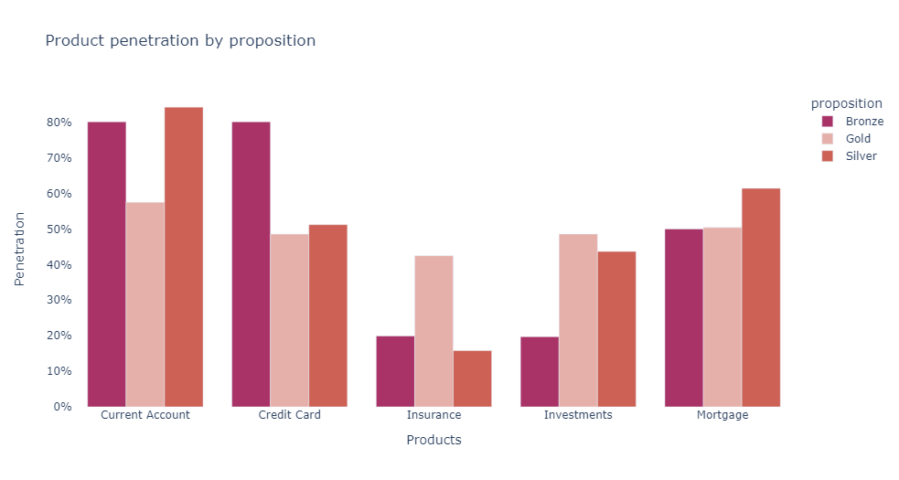

# Customer base global retail bank

https://www.kaggle.com/datasets/charlottetu/customer-base-global-retail-bank

Its a data on customer of a bank is operating in global market.

This is aggregated data, i.e. there are multiple customers per row. Dimensions tend to be earlier columns, measures to the right.

# Questions
## 1. Which country is most profitable?
### Hong kong generates more revenue rather than other countries whereas number of customers of Hong Kong is less

## 2. Which is most selling product?
### The chart show Current Account is most popular selling product then credit card and mortgage

 

## 3. On what products should be emphasized for marketing?
### The chart shows customers are less interested on insurance and investment. So, the bank should emphasize on marketing to sell products, insurance and investment

 

## 4. On which proposition/product customer has less interested in investment by Tenure?
### The following graph shows that for each tenure (specific duration) group is less interested in invest on Bronze and Silver. On the otherhand interested more in Gold

 

## 5. Proposition by Customers, Investors and Revenue?
### Silver product owner holds significant percentage of customers and investors. But not revenue. Gold product owner generated 58% revenue.

## 6. Is TRB has impact on revenue generation?
### Relation between Total Relationship Balance vs Revenue is postive (most cases), while trb is increasing then revenue is increasing

## 7. How customers are digitally active based on proposition/product
### Gold product owner customers are less active in digital banking compare to bronze and silver product owner whether Gold is highest revenue generator

# Visual Presentation
## PPT

## Tableau

